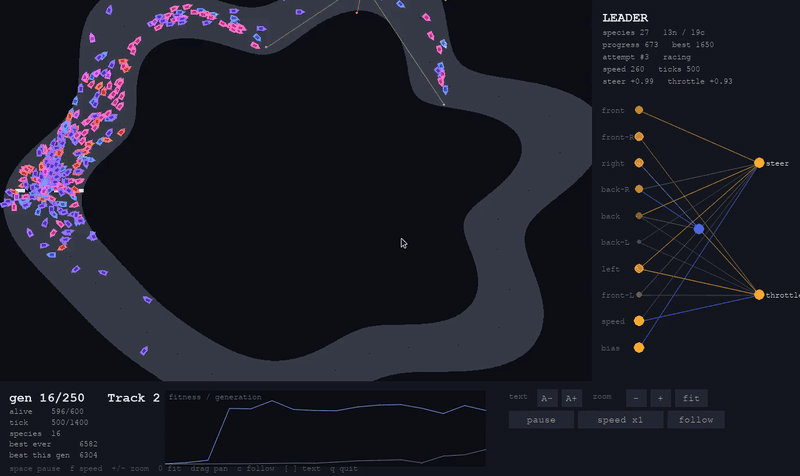

# cars

Self-driving cars evolved with NEAT. No hand-written driving logic - just
wall-detecting sensors, a neural net, and a genetic algorithm.



<sub>Generation 16 of a live run. The panel on the right is the leader's actual network:
its inputs are eight wall distances and its own speed, its outputs are steering and
throttle, and the hidden nodes between them were added by mutation, not by design.
A browser version you can run without installing anything is at
[neat-from-scratch](https://github.com/MarcoZorn/neat-from-scratch).</sub>

## What it does

- 1000 cars, 15 procedurally generated tracks, 250 generations
- each car has 7 raycast sensors + speed as inputs, steering + throttle as outputs
- crashing doesn't end a car's race - it respawns at the start line and keeps
  trying until it finishes a lap or runs out of time
- fitness is the best single attempt, not the sum of attempts (so crash-spamming
  doesn't help)
- standard NEAT: speciation, fitness sharing, elitism, crossover, mutation

Tracks cycle each generation so the population doesn't just memorize one loop.

## Running it

```
pip install -r requirements.txt
python run.py
```

Controls:

- `space` pause
- `f` speed (1x / 4x / 16x)
- `+` / `-` / mouse wheel zoom, drag to pan, `0` to fit
- `c` follow the leader car
- `[` `]` UI text size
- `q` quit

## Files

- `neat_core/` - genome, mutation, crossover, speciation (standard NEAT)
- `tracks.py` - track generation (polar functions, always simple closed loops)
- `car.py` - physics, sensors, fitness
- `app.py` / `render.py` - the live viewer
- `test_cars.py` - `python test_cars.py`

MIT licensed.
